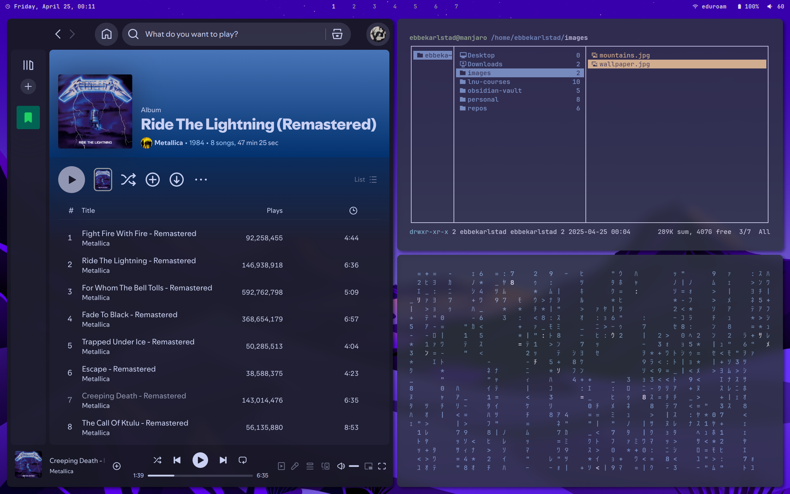
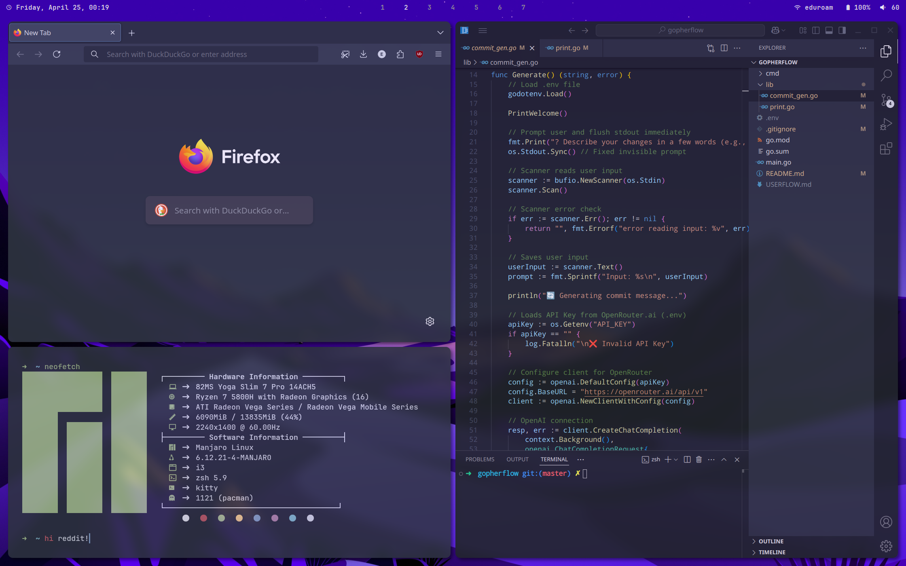

# Dotfiles - Minimal i3wm Arch Linux Setup
These are my dotfiles for my current Arch Linux i3wm setup! Note: These are all partly written by me and made by community members. I can't remember everyone I've "borrowed" configs from, but thanks.

   

  

---
#### My i3-gaps window manager configuration for Arch Linux, featuring:

  

-  **i3wm** with gap support

-  **Polybar** status bar with custom modules

-  **Rofi** app launcher (also runs commands)

-  **Kitty** terminal with custom themes

-  **Picom** compositor for cool effects

-  **Dunst** notification daemon

-  **Zsh** shell with syntax highlighting and auto-suggestions

  

## ✨ Features

  

-  **Window Management**

Tiling workflow with i3 gaps and custom keybindings

-  **Productivity Focus**

Quick application launching with Rofi, workspace management

-  **Aesthetic UI**

Clean Polybar layout, compositor effects, and consistent color scheme

-  **Easy Customization**

Well-organized configs with clear documentation

  

## 🛠️ Installation

  

### Requirements

- Arch Linux (or derivatives)

- i3-wm (i3-gaps)

- Polybar

- Rofi

- Picom (compton fork)

- Dunst

- Kitty terminal

  

### Quick Setup

1. Clone the repository:

> git clone https://github.com/ebbekarlstad/dotfiles.git

2. Install dependencies:

> sudo pacman -S i3-wm polybar rofi kitty dunst zsh picom

3. Install all configurations manually, or using a tool like Stow.

#### ⭐ Star this repo if you find it helpful!

